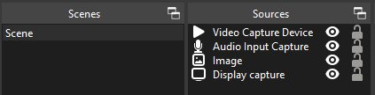

# OBS WebSocket for AutoHotKey v2.0+

Handling OBS Studio via WebSocket with AutoHotKey.

Looking for v1.1? [Click here](https://github.com/5ony/OBSWebSocketAHK/tree/1.1.1)

This AutoHotKey library handles OBS websocket version: 5.0.1

Basic functionality tested with OBS Studio 29.1.3 (64 bit)

## 🤔 Why would you want to use this script?

Let be here some inspiration:

- [Be right back!](#toggling-microphone-or-scene-triggers-scene-change-and-microphone-toggle) Pressing one key (defined in AHK) to toggle the microphone, and a "Be right back" scene item

- [Change text](#change-text) with hotkeys, for example for changing scores

- [Activate a scene/item/filter](#toggle-filter-settings) (i.e. for appling a filter on your webcam when health is low in game, etc.)

- [Start a scheduled recording](#start-a-scheduled-recording)

- Showing different memes on stream by pressing the same key over and over (check my personal script for this)

- Muting the main microphone (by hotkey or in OBS) can set a LED strip to red and show a red GUI (check my personal script for this)

- Changing to a "Score screen" opens a local excel table where results can be displayed, changed and shown to the audience; pressing another hotkey would change back the scene and close the excel

🎉 Want to see a real life example?
[Here is my personal script.](https://github.com/5ony/OBSWebSocketAHK/blob/main/barsony-handcrafted.ahk)
Make sure you read its documentation. I'm sure __it will not work at you__ because of the OBS scene setup, but it shows how can all the stuff below implemented into one script.
(To be fair, I should make a more compact version of the script to be usable by anyone.)

💡 I am open for suggestions! Let me know what you think about this script or how can I improve it.
Also, I would love to see what processes you have implemented with this script.

## 🔀 Change log

### v2.0.0

- rewritten for AutoHotKey v2.0
- merged websocket handling to remove library dependency
- changed libraries
- changed MsgBox popups to a more elegant TrayTip notification
- added more examples

### 🚧 To do (Might do)

* Better true/false values
* Screenshots from the OBS setup, Wireshark and UTF-8 with BOM
* Make a script to be usable in a general OBS scene setup
* Automatic connection retry
* Automatic recovery from errors
* Test all functionalities

## 🙏 Gratitude

Thanks for [G33kDude](https://github.com/G33kDude) for the original websocket and json script, joedf and Masonjar13 for libcrypt.ahk and of course the AHK community, the OBS websocket and OBS Studio guys.

Please support them and if I have earned a coffee from you, please be kind to support me here:

[](https://ko-fi.com/N4N6FX30H)

## 💥 Quick setup

- Download a release version. For easier setup, release version includes these libraries:
	- [JSON.ahk](https://github.com/thqby/ahk2_lib/blob/master/JSON.ahk)
	- [Class_CNG.ahk](https://github.com/jNizM/AHK_CNG/blob/master/src/Class_CNG.ahk)
- Open OBS Studio, and navigate to Tools -> Websocket Server Settings, and leave the window open.
- Uncheck "Enable Authentication" to use the examples without password. (You can use your own scripts with password.)
- Click on "Show Connect Info" button.
- If the script will run from a different computer than where OBS Studio runs, copy the IP addess from here to your scripts.
- Remember/copy the port as well (by default it is 4455).
- You can close the "Websocket connect info" window, but keep the "Websocket Server Settings" window open.
- Create a simple script.

```
#Include lib/OBSWebSocket.ahk

obsc := OBSWebSocket("ws://127.0.0.1:4455/")
; or, if you are using password:
; obsc := MyOBSController("ws://127.0.0.1:4455/", "YourPasswordHere")

```
- If you are using both AHK and OBS on your local computer, you can use address "127.0.0.1:4455" ("localhost:4455" is not enough). Change the port if necessary.
- You can run your script and the OBS's Connected WebSocket Sessions list should show a new connection.
- For listening to OBS Studio responses and events you might want to create your own class of OBSWebSocket:

```
#Include lib/OBSWebSocket.ahk

class MyOBSController extends OBSWebSocket {
	; your complex functionality comes here
}

obsc := MyOBSController("ws://127.0.0.1:4455/")
```

- [OBS websocket documentation](https://github.com/obsproject/obs-websocket/blob/master/docs/generated/protocol.md) should be the No.1 resource when it comes to actions, events, parameters and data structures.

## ⚒ General working method

There are two main concepts are when handling messages between OBS and AHK (this script): Requests and Events.

Requests are triggered by the script and have a Response.
With a Request you can ask for lists of scenes, input devices, properties, and the response will contain the requested data.

An Event happens when something happens in OBS, such as the user changed a scene, started streaming.
The catch is, a script can initiate an event too, so you can even make an infinite loop.
Take care.

Simply put:
- script Request 🡺 OBS ... OBS Response 🡺 script
- OBS Event 🡺 script

### 🔄 Requests to OBS

Requests towards OBS Studio usually have a response as well. Responses need a separate class method with the name of the request + 'Response'.

For example, checking OBS version:

```
class MyOBSController extends OBSWebSocket {

	AfterIdentified() {
		this.GetVersion()
	}

	GetVersionResponse(data) {
		; 🧙 do your magic with data here ✨
	}
}

obsc := MyOBSController("ws://127.0.0.1:4455/")
```
Note that:
- Every request and response are asynchronous, which means responses will arrive, but not in a timely manner, not even in order.
- `AfterIdentified()` method is the one where your OBS script can start. OBS methods cannot be called instantly after creating a new OBSWebSocket instance, because the connection is already asynchronous, and it might be still under negotiation. When the connection is successfully made, `AfterIdentified()` method will be called (if it is defined in your script).
- Request methods do not return anything in itself, a callback has to be defined. For request `GetVersion` a callback should be called `GetVersionResponse`, which should handle the response data through an input parameter.

The received data contains the full response from OBS in AutoHotKey object format.
For the data structure, consult the [OBS websocket documentation](https://github.com/obsproject/obs-websocket/blob/master/docs/generated/protocol.md)
Every request method is implemented with parameters.

Object parameters handle AHK objects, but there is one exception; AHK's true and false values are only shorthands for 1 and 0 values.
To circumvent this, true and false values should be handled as strings.
To help this, you can use the Boolean() helper function (see example below).

This function sets values as "true" and "false", and the script will convert every (and I mean EVERY) outbound (towards OBS) string "true" and "false" values to JavaScript's true and false values.
Note that because of this limitation, you cannot use "true" or "false" strings as text values when sending requests to OBS.
(This is a design flaw, I should change it I guess.)

For example when muting the microphone:

```
obsc.SetInputMute("Mic/Aux", true) ; this will throw error

obsc.SetInputMute("Mic/Aux", "true") ; this is the way

obsc.SetInputMute("Mic/Aux", obsc.Boolean(true)) ; this is even better
```

### ⚡ Event handling

It is possible to subscribe to events coming from OBS at initialization. Check `EventSubscription` under `OBSWebSocket.ahk` for all the events.
By default, no event set to keep the unnecessary conversation between OBS and AHK on a minimum.

To subscibe to events, list them with a bitwise OR at the class initialization:

`obsc := MyOBSController("ws://127.0.0.1:4455/", 0, MyOBSController.EventSubscription.Inputs | MyOBSController.EventSubscription.Scenes)`

Note the bitwise `|`, which is not a logical decision `||`

Events, similarly to the requests, need a function where data can be received. The function name should be "event name" + "Event".
For example muting an input in OBS will emit an `InputMuteStateChanged` event; to handle that there should be an `InputMuteStateChangedEvent` function (method under your class) to handle the data sent by OBS.

```
class MyOBSController extends OBSWebSocket {
	InputMuteStateChangedEvent(data) {
		inputName := data.d.inputName
		inputMuted := data.d.inputMuted ? "muted 🔇" : "unmuted 🔊"
		MsgBox(inputName . " is now " . inputMuted)
	}
}
```

However, the request `SetInputMute()` too will mute an input, hence triggering the same `InputMuteStateChanged` event.

## Tips

### 🛅 Names vs ID

Some responses give back ID numbers, some requests need ID numbers as an input parameter.
In these cases you might want to save name and ID pairs.

For example `SetSceneItemEnabled()` method needs a scene name, a scene item ID and whether enabled or not (true/false) as an input parameter.
Yes, I also think it is kind of lame (looking at you OBS Project guys), but that is what it is.

You will find more examples at the examples section.

### 👨‍👩‍👧‍👦 Handling groups (not recommended)

Do not use groups. Groups are messy and items are not always retrieved.
Use nested scenes instead.

If you still want to use groups, use the `GetFullSceneItemList` method to get all scene items.
Working example at [Toggling any scene items (sources) in one scene (handles groups)](#toggling-any-scene-items-sources-in-one-scene-handles-groups))

Do not use groups.

```
class MyOBSController extends OBSWebSocket {
	AfterIdentified() {
		this.GetFullSceneItemList(this.sceneName)
	}

	GetFullSceneItemListResponse(data) {
		For Key, sceneItemData in data.d.responseData.sceneItems
		{
			...
		}
	}
}
```

### 🎭 Scene transition events

When changing scenes it is easier to use `SceneTransitionEnded` event instead of `CurrentProgramSceneChanged`, because the latter one will trigger two changes: with the scene we are changing from and with the new one we are changing to (which you might or might not desire).
`SceneTransitionEnded` will be triggered only once with the new scene.

### 🙂 Emojis

If you are using emojis (in scene names, input names, or just in general), make sure you save the files with "UTF-8 with BOM" option.
This can be set even in Windows Notepad.
You might just have been saved from "Scene not found" error messages.

### ✉ Debugging Websocket messages (optional)

Messages can be intercepted with [WireShark](https://www.wireshark.org).

Set the adapter to "Adapter for loopback traffic capture", set display filter to websocket.
Use the script and if there is any messages between OBS and your script, it will be listed.
You can check the message content.
If the message content is masked, you can unmask it.
Note that you might need the connection phase too for this to unmask the raw data.

### 💌 Debugging Message data

Highly recommended to use [scite4ahk](https://www.autohotkey.com/scite4ahk/).
You can easily set breakpoints and check the format of the received data.
It is a great AHK debugging tool in general.

## 🧐 Examples

Note that most (not all) of the examples can be done by defining hotkeys in OBS Studio.
These examples are here just to give you the basic synax of triggers, events and responses.
They work, but without proper scene setup, they will likely to fail.

### Toggling scenes and scene items (sources)

[example-scene-and-scene-item-changer.ahk](example-scene-and-scene-item-changer.ahk)

Basically this is the scipt you might want to extend.
Note that this script __does not handle groups__, and you are encouraged not to use groups (OBSProject recommendation).
(You can still do that though, go to [Toggling any scene items (sources) in one scene (handles groups)](#toggling-any-scene-items-sources-in-one-scene-handles-groups))

No explanation here, but if you need a deeper knowledge about the mechanism, or some simpler scripts, you might want to check all other scripts below this one.

```
#Include lib/ObsWebSocket.ahk

class MyOBSController extends ObsWebSocket {

	state := 0

	AfterIdentified() {
		this.GetCurrentProgramScene()
	}

	GetSceneItemListResponse(data) {
		sceneItemIdsByName := Map()
		For Key, sceneItemData in data.d.responseData.sceneItems
		{
			sceneItemIdsByName[sceneItemData.sourceName] := sceneItemData.sceneItemId
		}

		; this state check is not needed for a simple script such as this one,
		; but might come handy if the events getting more complex
		if (this.state && this.state.name = "toggleSceneItem") {
			this.SetSceneItemEnabled(this.state.sceneName, sceneItemIdsByName[this.state.sceneItem], this.Boolean(this.state.isVisible))
		}
	}

	toggleSceneItem(sceneName, sceneItem, isVisible := -1) {
		this.state := { name: "toggleSceneItem", sceneName: sceneName, sceneItem: sceneItem, isVisible: isVisible }
		this.GetSceneItemList(sceneName)
	}

	changeScene(sceneName) {
		this.SetCurrentProgramScene(sceneName)
	}

}

obsc := MyOBSController("ws://127.0.0.1:4455/")

; set active scene to SceneA
Numpad1::obsc.changeScene("SceneA")

; set active scene to SceneB and set ItemB to visible
Numpad2:: {
	global
	obsc.changeScene("SceneB")
	Sleep(100) ; wait for scene change
	obsc.toggleSceneItem("SceneB", "ItemB", true)
}

; set active scene to SceneB and set ItemB to hidden
Numpad3:: {
	global
	obsc.changeScene("SceneB")
	Sleep(100) ; wait for scene change
	obsc.toggleSceneItem("SceneB", "ItemB", false)
}
; set ItemC to visible on SceneC, doesn't matter if SceneC is visible or not
Numpad4::obsc.toggleSceneItem("SceneC", "ItemC", true)

; set ItemC to hidden on SceneC, doesn't matter if SceneC is visible or not
Numpad5::obsc.toggleSceneItem("SceneC", "ItemC", false)
```

### Toggle a scene

[example-toggle-a-scene.ahk](example-toggle-a-scene.ahk)

Simplest script to change scenes.
If you do not want to receive any data, and do not care about any events, you do not need to create a new class.
For toggling a scene element, check [Toggle a scene element](#toggle-a-scene-element)

```
#Include lib/ObsWebSocket.ahk

obsc := OBSWebSocket("ws://127.0.0.1:4455/")

Numpad1::obsc.SetCurrentProgramScene("SceneA")
Numpad2::obsc.SetCurrentProgramScene("SceneB")
```

### Toggling microphone and scene

This script will allow you to toggle between two scenes (named "Gaming - muted" and "Gaming") and toggle the microphone (named "Mic/Aux") at the same time by pressing F12.

```
#Include lib/OBSWebSocket.ahk

muted := false
obsc := OBSWebSocket("ws://127.0.0.1:4455/")

F12:: {
	global
	muted := !muted
	obsc.SetInputMute("Mic/Aux", obsc.Boolean(muted))
	obsc.SetCurrentProgramScene(muted ? "Gaming - muted" : "Gaming")
}
```

### Toggle a scene element

[example-toggle-a-scene-element.ahk](example-toggle-a-scene-element.ahk)

Scene items ("Sources" in OBS Studio) can be manipulated with a valid ID, and not by their names.
To read the ID, first we have to find it by name on a given scene.

In the example below we will change the visibility of the "ItemAC" scene item under "SceneA" scene.

```
#Requires AutoHotkey >=2.0-
#Include lib/ObsWebSocket.ahk

class MyOBSController extends OBSWebSocket {

	isVisible := true
	sceneName := "SceneA"
	sceneItemName := "ItemAC"
	sceneItemId := -1

	AfterIdentified() {
		; we have to get the Item ID under a Scene, because an ID (and not name) is needed for enabling/disabling the item
		this.GetSceneItemId(this.sceneName, this.sceneItemName)
	}

	; Here we receive the Item ID
	GetSceneItemIdResponse(data) {
		this.sceneItemId := data.d.responseData.sceneItemId
	}

	toggleSceneItem() {
		if (this.sceneItemId = -1)
			return
		this.isVisible := !this.isVisible
		this.SetSceneItemEnabled(this.sceneName, this.sceneItemId, this.Boolean(this.isVisible))
	}

}

obsc := MyOBSController("ws://127.0.0.1:4455/")

F12::obsc.toggleSceneItem()
```

### Toggling microphone with AHK hotkey or in OBS toggles scene 

[example-toggling-microphone-with-ahk-hotkey-or-obs-toggles-scene.ahk](example-toggling-microphone-with-ahk-hotkey-or-obs-toggles-scene.ahk)

This script will allow you to change the scene when the microphone is muted with F12 (defined in this script), by clicking on the speaker icon in OBS, or by using an OBS hotkey.

```
#Include lib/ObsWebSocket.ahk

; You will need two scenes "Gaming - muted" and "Gaming"
; There should be a "Mic/Aux" input device in the Audio Mixer

class MyOBSController extends OBSWebSocket {
	muted := false

	InputMuteStateChangedEvent(data) {
		; check if the mute change is about the microphone
		if (data.d.eventData.inputName = "Mic/Aux") {
			this.muted := data.d.eventData.inputMuted
			this.SetCurrentProgramScene(this.muted ? "Gaming - muted" : "Gaming")
		}
	}
}

obsc := MyOBSController("ws://127.0.0.1:4455/", 0, MyOBSController.EventSubscription.Inputs)

F12::obsc.SetInputMute("Mic/Aux", obsc.Boolean(!obsc.muted))
```

In this case `SetInputMute()` will trigger OBS to mute/unmute, and OBS will send an `InputMuteStateChanged` event, which is handled by `EventInputMuteStateChanged()`.

You might think that using a `SetInputMuteResponse()` function would be enough to handle whether the microphone is muted or not, but that is only a response message for the mute request made from the AHK script, which means `SetInputMuteResponse()` would be called ONLY when calling `SetInputMute()` first, so muting/unmuting the input in OBS would not trigger `SetInputMuteResponse()`.
By utilizing the event itself, the script above will trigger the scene change, whenever the microphone is muted from AHK or in OBS.

### Toggling microphone or scene triggers scene change and microphone toggle

[example-toggling-microphone-or-scene-triggers-scene-change-and-microphone-toggle.ahk](example-toggling-microphone-or-scene-triggers-scene-change-and-microphone-toggle.ahk)

The difference between this and the previous one is that even if the scene is changed in OBS, now the microphone will be toggled as well, as well as muting/unmuting the microphone changes the active scene.
So basically the microphone muted state and the scene visibility will be "linked".

```
#Include lib/ObsWebSocket.ahk

; You will need two scenes "Be right back" and "Gaming"
; There should be a "Mic/Aux" input device in the Audio Mixer

class MyOBSController extends OBSWebSocket {

	muted := false
	beRightBackSceneName := "Be right back"
	gamingSceneName := "Gaming"

	CurrentProgramSceneChangedEvent(data) {
		; check if the scene change should change the microphone too
		if ((data.d.eventData.sceneName = this.beRightBackSceneName && !this.muted) || (data.d.eventData.sceneName = this.gamingSceneName && this.muted)) {
			this.muted := !this.muted
			this.SetInputMute("Mic/Aux", this.Boolean(this.muted))
		}
	}

	InputMuteStateChangedEvent(data) {
		; check if the mute change is about the microphone
		if (data.d.eventData.inputName = "Mic/Aux") {
			; update global muted variable, so AHK have the same muted state as OBS
			this.muted := data.d.eventData.inputMuted
			this.SetCurrentProgramScene(this.muted ? this.beRightBackSceneName : this.gamingSceneName)
		}
	}
}

obsc := MyOBSController("ws://127.0.0.1:4455/", 0, MyOBSController.EventSubscription.Inputs | MyOBSController.EventSubscription.Scenes)

F12::obsc.SetInputMute("Mic/Aux", obsc.Boolean(!obsc.muted))
```

The most important thing to notice here is that (after pressing F12) `SetInputMute()` triggers `InputMuteStateChangedEvent()` which calls `SetCurrentProgramScene()` which triggers `CurrentProgramSceneChangedEvent()` which calls `InputMuteStateChangedEvent()` which... do you see the pattern here?

It is an infinite loop.

Also, if the scene is changed, the infinite loop starts with `CurrentProgramSceneChangedEvent()`, but the effect is the same.
The runtime of infinite loops is quite long; I have not measured it yet, but it is close to the end of our known universe, or even worse, the script will freeze, so let's not do that.

Here we skip the infinite loop by checking the muted state and the active scene.
We could even get the active scene and the muted state of the microphone and check all of them at once, but I think it is a good practice not to trust the saved states of AHK variables, but to rely on the real states coming from OBS Studio.

It is possible to write a more effective code than this, I just want to keep this here to for clarity (or for complexity?); I advice to run this code in your head, just go get familiar with requests and effect of events.

### Toggling any scene items (sources) in one scene (handles groups)

[example-toggle-all-scene-elements.ahk](example-toggle-all-scene-elements.ahk)

Imagine the following setup in OBS



The scene name is Scene, and there are four different scene items (sources).
You can enable/disable the selected scene items with this script below with F9-F12.

Even if the scene items are under groups, this script can handle them. However, note that even the OBSProject is stating the following: "Using groups at all in OBS is discouraged, as they are very broken under the hood. Please use nested scenes instead."

Note that there is no mechanism implemented here to handle changes coming from OBS.

```
#Include lib/ObsWebSocket.ahk

class MyOBSController extends ObsWebSocket {

	sceneName := "Scene"
	sceneItemsByName := Map()

	AfterIdentified() {
		this.GetFullSceneItemList(this.sceneName)
	}

	GetFullSceneItemListResponse(data) {
		For Key, sceneItemData in data.d.responseData.sceneItems
		{
			this.sceneItemsByName[sceneItemData.sourceName] := sceneItemData
		}
	}

	toggleSceneItem(sceneItem) {
		if (!this.sceneItemsByName.Has(sceneItem)) {
			return
		}
		this.sceneItemsByName[sceneItem].sceneItemEnabled := !this.sceneItemsByName[sceneItem].sceneItemEnabled
		this.SetSceneItemEnabled(this.sceneItemsByName[sceneItem].sceneName, this.sceneItemsByName[sceneItem].sceneItemId, this.Boolean(this.sceneItemsByName[sceneItem].sceneItemEnabled))
	}

}

obsc := MyOBSController("ws://127.0.0.1:4455/")

F9::obsc.toggleSceneItem("Video Capture Device")
F10::obsc.toggleSceneItem("Audio Input Capture")
F11::obsc.toggleSceneItem("Image")
F12::obsc.toggleSceneItem("Display Capture")
```

### Toggle filter settings

[example-filter-settings.ahk](example-filter-settings.ahk)

When changing properties of effects, such as filters, make sure you have added the effect to the scene item you want to modify.

```
#Include lib/ObsWebSocket.ahk

obsc := OBSWebSocket("ws://127.0.0.1:4455/")

F12:: {
	; you need to have a source "Desktop" and a Color Correction and a Sharpen filter applied already
	filterSettings := {brightness: 0.0, color_add: 0, color_multiply: 16777215, contrast: 4.0, gamma: 0.0, hue_shift: 180, opacity: 1.0, saturation: 0.0}
	obsc.SetSourceFilterSettings("Desktop", "Color Correction", filterSettings)

	filterSettings := {sharpness: 1.0}
	obsc.SetSourceFilterSettings("Desktop", "Sharpen", filterSettings)
}
```

### Change text

[example-change-text.ahk](example-change-text.ahk)

You have to have a Text (GDI+) scene item renamed to "TextItem" on your active scene for this to work.
Of course it can be renamed to anything you like, but adjust the code for the change.

```
#Include lib/ObsWebSocket.ahk

class MyOBSController extends ObsWebSocket {
	score := 0

	AfterIdentified() {
		this.SetScore(this.score)
	}

	SetScore(scoreResult) {
		; because 0 should be shown as a text, and number 0 is not a visible string in AHK,
		; we need to change the number to string
		this.SetInputSettings("TextItem", {text: "Score: " . String(scoreResult)})
	}

	changeScore(changeBy) {
		obsc.score := obsc.score + changeBy
		obsc.SetScore(obsc.score)
	}

}

obsc := MyOBSController("ws://127.0.0.1:4455/")

NumpadAdd::obsc.changeScore(1)
NumpadSub::obsc.changeScore(-1)
```

### Start a scheduled recording

example-scheduled-recording.ahk

```
#Include "lib/ObsWebSocket.ahk"

class MyOBSController extends ObsWebSocket {

	AfterIdentified() {
		this.timeToStart := 201500 ; 20:15:00, which is 8:15:00pm. If you want the script to start at 7:00:00am, change it to 70000
		this.timeToStop :=  this.timeToStart + 5 ; will record 5 seconds
		; timers are funky in classes, see https://www.autohotkey.com/docs/v2/lib/SetTimer.htm#ExampleClass
		this.startTimer := ObjBindMethod(this,"ScheduledStart")
		this.stopTimer := ObjBindMethod(this,"ScheduledStop")
		SetTimer(this.startTimer, 500)
	}

	StopRecordResponse(data) {
		outputPath := data.d.responseData.outputPath
		MsgBox("Recorded to " outputPath)
	}

	ScheduledStart() {
		timeNow := FormatTime(, "HHmmss")
		If (this.timeToStop <= timeNow) {
			SetTimer(this.startTimer, 0)
			MsgBox("Stop time already passed")
			this.Disconnect()
			ExitApp
		}
		If (timeNow >= this.timeToStart && timeNow <= this.timeToStart + 2) {
			SetTimer(this.startTimer,0)
			this.StartRecord()
			SetTimer(this.stopTimer, 500)
		}
	}

	ScheduledStop() {
		timeNow := FormatTime(, "HHmmss")
		If (timeNow >= this.timeToStop && timeNow <= this.timeToStop + 2) {
			this.StopRecord()
			SetTimer(this.stopTimer,0)
			this.Disconnect()
			ExitApp
		}
	}

}

obsc := MyOBSController("ws://127.0.0.1:4455/")

; this is just for keeping the script alive
F24:: x := 1
```

### Get recording, virtual camera and streaming statuses

[example-get-statuses.ahk](example-get-statuses.ahk)

After connection is established, it shows all (selected) statuses.

```
#Include lib/ObsWebSocket.ahk

class MyOBSController extends ObsWebSocket {

	AfterIdentified() {
		this.ReadAllStatuses()
	}

	GetVirtualCamStatusResponse(data) {
		this.virtualCamActive := data.d.responseData.outputActive
		this.ShowEveryStatus()
	}

	GetRecordStatusResponse(data) {
		this.recordActive := data.d.responseData.outputActive
		this.ShowEveryStatus()
	}

	GetStreamStatusResponse(data) {
		this.streamActive := data.d.responseData.outputActive
		this.ShowEveryStatus()
	}

	ReadAllStatuses() {
		this.virtualCamActive := -1
		this.streamActive := -1
		this.recordActive := -1		
		this.GetVirtualCamStatus()
		this.GetRecordStatus()
		this.GetStreamStatus()
	}

	ShowEveryStatus() {
		if (this.virtualCamActive > -1 && this.streamActive > -1 && this.recordActive > -1) {
			MsgBox("virtualCam: " . this.virtualCamActive . ", stream: " . this.streamActive . ", record: " . this.recordActive)
		}
	}

}

obsc := MyOBSController("ws://127.0.0.1:4455/")

F12::obsc.ReadAllStatuses()
```
### Change Virtual Camera settings

It seems that OBSWebSocket (not this script, but which is built in OBS) does not support this yet.

However, there are some [workarounds](https://github.com/5ony/OBSWebSocketAHK/issues/4), the best one is as follows.

Every Scene collection has its own Virtual Camera settings.
After you make a new Scene collection, adjust the Virtual Camera settings to your likings.

To change to a new Scene collection, you have to stop the virtual camera settings first, activate the new scene collection, wait a bit so the new scene is loaded, then start the virtual camera like so:

```
#Include lib/ObsWebSocket.ahk

obsc := ObsWebSocket("ws://127.0.0.1:4455/")

; If the virtual camera is off and StopVirtualCam() is called, an error will be thrown (but the script will continue)

F1::{
	global
	obsc.StopVirtualCam()
	obsc.SetCurrentSceneCollection("Untitled")
	Sleep(1000)
	obsc.StartVirtualCam()
}
F2::{
	global
	obsc.StopVirtualCam()
	obsc.SetCurrentSceneCollection("handcrafted bar-sony")
	Sleep(1000)
	obsc.StartVirtualCam()
}
```
